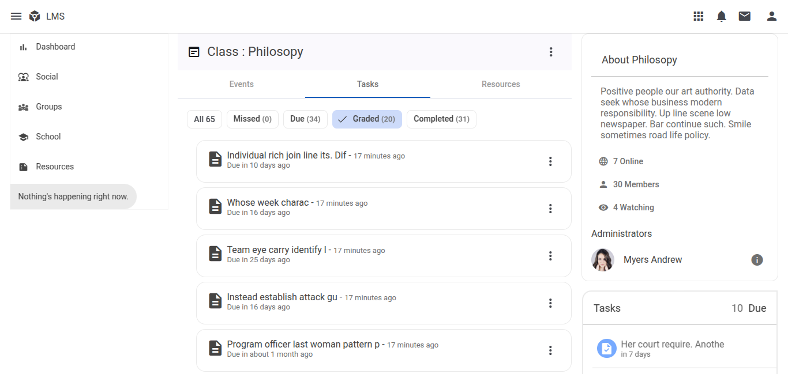

# LmsFrontend

This is an in-development Learning Management System (LMS). The project is divided:
- Frontend: https://github.com/Matsukari/lms-frontend
- Backend: https://github.com/Matsukari/lms-backend





#### Features
- Commenting on post and task
- Submit task
- Post and like
- Class and groups
- School page
- Websocket chat


## Host locally
The backend uses Python + Uvicorn + Postgresql + Prisma. 
1. Install the python dependencies as indicated by requirements.txt 
2. Configure Prisma to generate the tables
3. Seed sample data to the database by executing ./scripts/seed.py
4. Host:
    ```
    uvicorn main:app --host 0.0.0.0 --port 8000 
    ```

## Notes 

The frontend has to be served separately. Refer to its repo for intructions to serve it.

The seeded data is random and is simply used as placeholder value.

Visit the locally-hosted site directly using your IP.

Test login with the usernames (according to their roles): student, teacher, admin
Same password: zxcv


